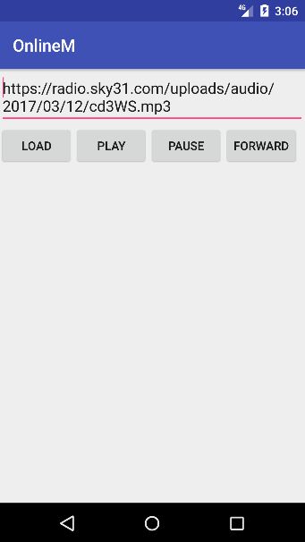

# OnlineM
## 一个支持在线缓存、播放和下载的MediaPlayer封装
### Android里使用MediaPlayer由于缺少缓存的功能（带缓存管理），因此在这里封装一下，方法就是很普通的内建SocketServer的方式，将本地url给MediaPlayer。
#### 在 [拱拱APP](https://g.sky31.com) 中通过此法实现 四季电台 模块
#### PS：缓存处理基本功能可用，正在完善（支持手动设置本地缓存校验）；下载处理正在写

### 使用说明（How to use）
<pre>
onlineM = new OnlineM(context, port, new OnlineMInterface() {
            @Override
            public String cacheFileName(String i) {
                return md5(i); //缓存名处理
            }

            @Override
            public String downloadFileName(String i) {
                return null; //下载名处理
            }

            @Override
            public boolean isSameCache(File file, long newSize) {
                return (file.length() == newSize); //缓存存在验证
            }

            @Override
            public void onCacheProgress(String url, String cacheUri, float progress) {
                //缓存进度
            }

            @Override
            public void onMediaPlayProgress(float progress, long cur, long duration) {
                //播放进度
            }

            @Override
            public void onDonwloadProgress(float progress, long downloaded, long filesize) {
                //下载进度
            }

            @Override
            public void onMediaPrepared() {
                //media准备完成
                onlineM.mediaStart();
            }

            @Override
            public void onMediaBufferingUpdate(float progress) {
                //media buffering进度
            }
            
            @Override
            public void onMediaCompleted() {
                //media 播放结束
            }
        });
        onlineM.setConfig(dirCache,dirDownload);//设置缓存和下载目录
        onlineM.load(url);//开始加载一个网络音频
</pre>